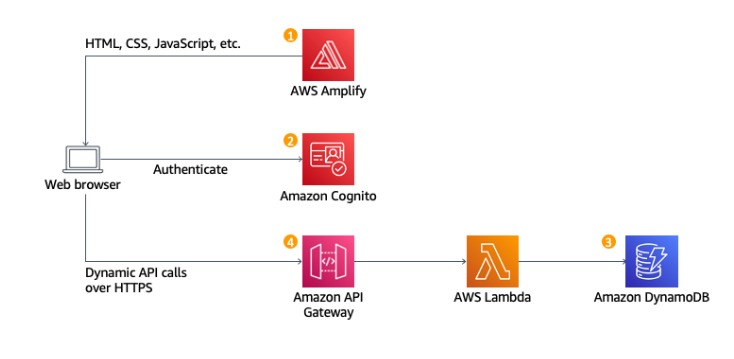

# 🦄 Wild Rydes - Serverless Web Application (AWS Lab)

Aplicação web serverless desenvolvida com base no laboratório prático da AWS, utilizando serviços gerenciados para autenticação, API, processamento e armazenamento dos pedidos de viagens.

> **Nota:** O projeto foi adaptado para funcionar com as versões atuais dos serviços, runtimes e console da AWS.

## 📚 Tutorial Base

[Build a Serverless Web Application — AWS](https://aws.amazon.com/pt/getting-started/hands-on/build-serverless-web-app-lambda-apigateway-s3-dynamodb-cognito/)

---

## 🚀 Arquitetura

```text
AWS Amplify
    │
    ▼
Frontend
    │
    ├── Amazon Cognito
    │     └── Autenticação / JWT
    │
    ▼
Amazon API Gateway
    │
    ├── Cognito Authorizer
    │
    ▼
AWS Lambda
    │
    ▼
Amazon DynamoDB
```

### Serviços utilizados

* **AWS Amplify** — hospedagem do frontend estático.
* **Amazon Cognito** — cadastro, login e geração de tokens JWT.
* **Amazon API Gateway** — exposição da API e autorização das requisições.
* **AWS Lambda** — processamento dos pedidos de viagem.
* **Amazon DynamoDB** — armazenamento das viagens.
* **ArcGIS API for JavaScript** — mapa, localização e animações de rota.

---

## 🧠 Por que utilizar API Gateway?

Embora seja possível invocar uma função Lambda diretamente pelo frontend através do SDK da AWS, neste projeto o **API Gateway** funciona como ponto de entrada da aplicação.

Ele permite:

* validar o JWT através do **Cognito Authorizer**;
* disponibilizar endpoints HTTP como `POST /ride`;
* configurar CORS;
* separar o frontend da implementação da Lambda;
* controlar rotas e stages da API.

Fluxo da requisição:

```text
Frontend
   │
   │ Authorization: JWT
   ▼
API Gateway
   │
   │ Cognito Authorizer
   ▼
AWS Lambda
   │
   ▼
DynamoDB
```

---

# 🔄 Adaptações do Laboratório

O tutorial original possui etapas que não correspondem mais ao console ou às versões atuais dos serviços AWS.

Abaixo estão as principais adaptações realizadas durante o laboratório.

---

## 1. AWS Amplify — Hospedagem

### Mudança

O projeto utiliza o **AWS Amplify** para hospedar os arquivos estáticos da aplicação.

A aplicação foi publicada com os arquivos HTML, CSS e JavaScript, e a URL gerada pelo Amplify passou a ser utilizada como endereço do frontend.

---

## 2. Amazon Cognito — Gerenciamento de Usuários

### Mudança

O console do Cognito foi redesenhado e o fluxo apresentado no tutorial não aparece mais da mesma forma.

Configuração utilizada:

| Configuração       | Valor                         |
| ------------------ | ----------------------------- |
| Application type   | Single-page application (SPA) |
| Name               | WildRydes                     |
| Sign-in identifier | Username                      |
| Required attribute | Email                         |
| Return URL         | URL do site no Amplify        |

Os valores utilizados posteriormente no `js/config.js` são:

* **User Pool ID** — disponível em `Overview`;
* **Client ID** — disponível em `App clients`.

### ⚠️ Pontos importantes

Para envio dos e-mails de confirmação, foi utilizado:

```text
Send email with Cognito
```

Usar **Amazon SES** exige configuração e verificação de identidade no SES.

Como o frontend é uma **SPA pública**, o App Client também não utiliza `Client Secret`.

> Alguns nomes apresentados na versão em português do tutorial não correspondem exatamente aos nomes atuais do console. Quando necessário, foi utilizada como referência a interface em inglês.

---

## 3. AWS Lambda — Atualização do Node.js e SDK

### Mudança

O tutorial original utilizava **Node.js 16.x** e o AWS SDK v2:

```javascript
const AWS = require('aws-sdk');
```

Essa implementação precisou ser atualizada para um runtime Node.js atualmente suportado e para o **AWS SDK for JavaScript v3**.

### Principais alterações

| Tutorial original     | Implementação atual          |
| --------------------- | ---------------------------- |
| `aws-sdk` v2          | AWS SDK v3                   |
| `require(...)`        | `import ... from ...`        |
| `index.js`            | `index.mjs`                  |
| `exports.handler`     | `export const handler`       |
| `ddb.put().promise()` | `ddb.send(new PutCommand())` |

Exemplo dos imports:

```javascript
import { DynamoDBClient } from '@aws-sdk/client-dynamodb';
import {
    DynamoDBDocumentClient,
    PutCommand
} from '@aws-sdk/lib-dynamodb';
```

A tabela utilizada continua sendo:

```text
Rides
```

> O nome configurado no DynamoDB deve corresponder exatamente ao nome utilizado pela função Lambda.

---

## 4. API Gateway — Cognito Authorizer

### Problema encontrado

O tutorial traduz o campo referente ao header HTTP `Authorization`, o que pode causar uma configuração incorreta do **Token Source**.

O valor correto é literalmente:

```text
Authorization
```

Caso o campo fique vazio ou seja configurado incorretamente, pode ocorrer o erro:

```text
Invalid token source expression: method.request.header..

The source must be a method request header, matching
'method.request.header.[a-zA-Z0-9._-]+'
```

### Configuração utilizada

| Configuração | Valor                     |
| ------------ | ------------------------- |
| Nome         | WildRydes                 |
| Tipo         | Cognito                   |
| Região       | Mesma região do User Pool |
| User Pool    | WildRydes                 |
| Token Source | `Authorization`           |

O endpoint utilizado pela aplicação é:

```http
POST /ride
```

Após criar e publicar a API, a **Invoke URL** do stage `prod` é adicionada ao `js/config.js`.

---

## ⚠️ Outras observações

O template **Executar pilha** do CloudFormation disponibilizado pelo laboratório retornou:

```text
403 Forbidden
```

Por isso, a configuração manual através do console da AWS foi mantida.

Além disso, o `invokeUrl` do `js/config.js` só pode ser preenchido depois da criação e publicação da API no API Gateway.

---

## 📁 Estrutura do Projeto

```text
.
├── js/
│   ├── config.js
│   ├── esri-map.js
│   └── ride.js
│
├── ride.html
├── image.png
└── README.md
```

### Arquivos principais

* **`js/config.js`** — configurações do Cognito, região AWS e URL do API Gateway.
* **`js/esri-map.js`** — inicialização do mapa, pontos de coleta e animações.
* **`js/ride.js`** — autenticação da sessão, requisição `POST /ride` e tratamento da resposta.
* **`ride.html`** — interface para seleção da localização e solicitação da viagem.

---

## ⚙️ Configuração

Configure o arquivo:

```text
js/config.js
```

com os recursos criados na sua conta AWS:

```javascript
window._config = {
    cognito: {
        userPoolId: 'SEU_USER_POOL_ID',
        userPoolClientId: 'SEU_CLIENT_ID',
        region: 'us-east-1'
    },

    api: {
        invokeUrl: 'SUA_URL_DO_API_GATEWAY'
    }
};
```

Substitua:

* `SEU_USER_POOL_ID` pelo ID do User Pool;
* `SEU_CLIENT_ID` pelo ID do App Client;
* `SUA_URL_DO_API_GATEWAY` pela Invoke URL do stage publicado.

---

## 🗺️ Interface



---

## 🧰 Tecnologias

* HTML
* CSS
* JavaScript
* AWS Amplify
* Amazon Cognito
* Amazon API Gateway
* AWS Lambda
* Amazon DynamoDB
* AWS SDK for JavaScript v3
* ArcGIS API for JavaScript

---

## 📌 Sobre o Projeto

Projeto desenvolvido para **estudo de arquitetura Serverless na AWS**, baseado no laboratório Wild Rydes.

Além da implementação da aplicação, este repositório registra as principais adaptações necessárias para executar o laboratório utilizando as versões atuais dos serviços e do console da AWS.
